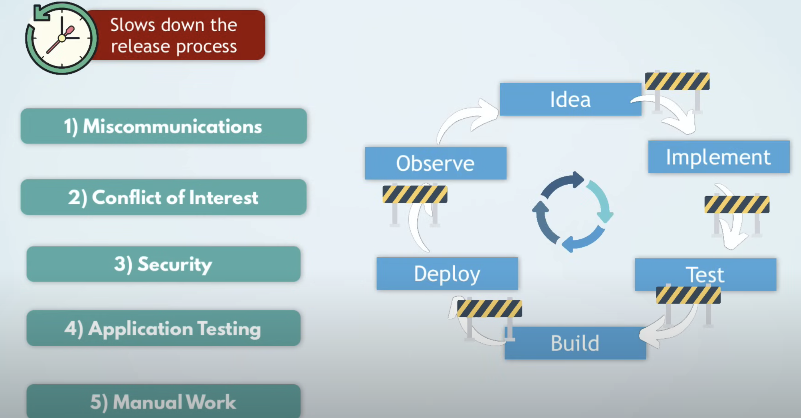

# DevOps

#### Source: https://www.youtube.com/watch?v=0yWAtQ6wYNM

DevOps is something between development and operations 

The main goal: 
- APP ---> deliver application to end usr 

Configure the server:
- Installing tools
- Deploy application
- Configure Firewall 

#### To keep track of updates (changes), we version those changes. 

For versioning, we have a template and rule: 

e.g., `1.4.2`

`1` is for major changes 
`4` minor changes (editing one small feature)
`2` one for quick small changes (bugfix) 

#### DevOps is for making this continuous devilery fast with minimal bugs. 

Quickly delivering high quality code is a big challenge. 

Challenges in the release process: 

- Misscommunication and lack of collaboration between developers and operations 

    * code the application (Developers)
    * Deploy and operate the application (operations for running the application) 

Deployment guide not well documented. so the release takes longer. Or developers finish coding but the feature cannot be deployed because it has lot of issues and the operations throws it back with improvement suggestions. 

This kind of misscommunication could cause streching the release periods for days, weeks or months. 

So between developer is done with the feature and operation starts deploying it, there is no clearly defined automated process of handover. It's based on a complex bureaucratic process of what checklists need to be completed and what needs to be documented and who needs to manually approve what for the release and so on. 

So steamlines and automated process is here. 

#### 2- Conflict of Interest 

Operations want to make sure changes won't break anything. Operations want to maintain stability in production and their focus is to make sure application is available and does not crash. So operations need to resist the speed of release and check all aspects of new release to make sure it's 100% safe which this slows down the process. Especially that the operations don't really understand the code or the applications, so there is more effort for them to evaluate this new release. 

For example let's say developers developed a new feature which was released, but this feature consumes so much resources in the production environment that the servers got overloaded and the application crashed. Now operations team needs to fix that. So the developers may not be careful as the operations about the changes they releasse. 

Also security team will evaluate any changes to make sure they don't effect system's security. 

So these procedures slows down the process. So the DevOps is about to remove any roadblocks that slow down the process. so the security is also part of the DevOps. But there is a separate term of security is defined for DevOps and it's called DevSecOps 

This testing may not be done by the Development or Operations rule but with a separate Testing rule. 

This testing is also slowing down the process since these tests are done manually. 

This manual work is slow and more error-prone. 

Plus with the manual work, knowledge sharing is difficult. Because people have to document it and others have to read it. 

It's also very intransparent cause it's hard to trace, who execute what when. 

Also if something happens to the infrastructure, it maybe really hard to recover and replicate the exact state fast. 

DevOps tries to remove these roadblocks and things that slow down the release process. 

Many companies, implemented DevOps in different ways. But some patterns are common. 

