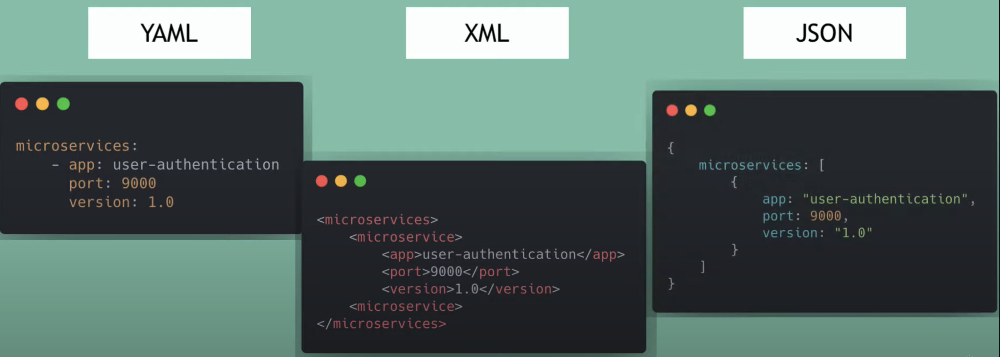
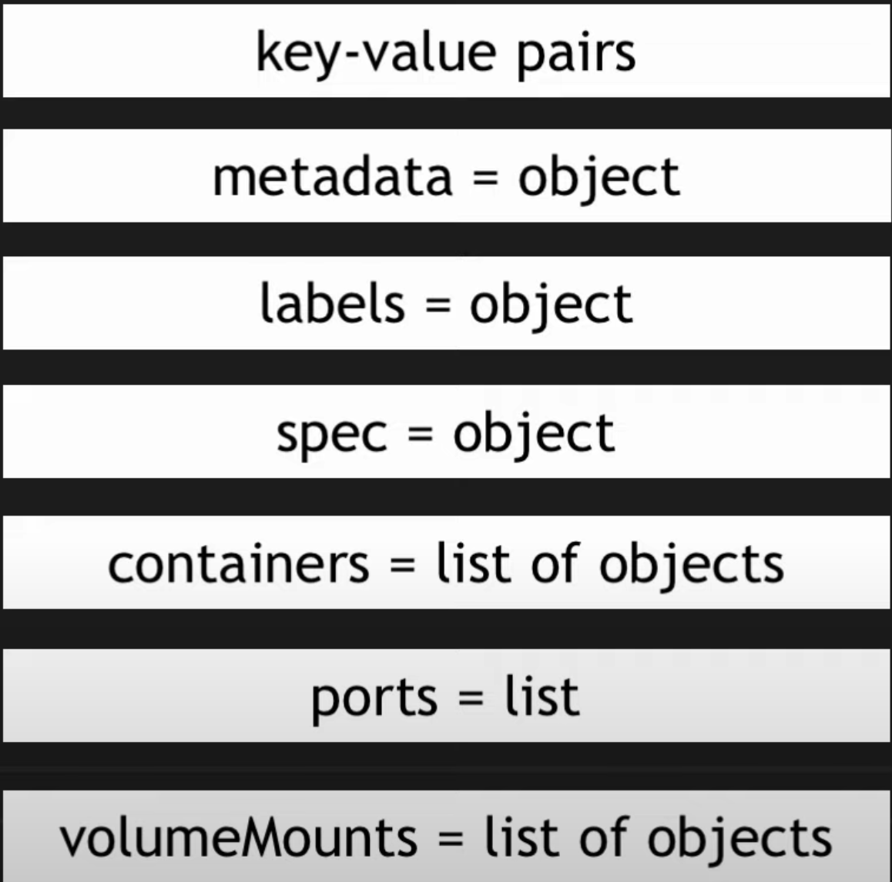

# YAML

- Configuration files all writeen in YAML

- Widely used format 

- For different DevOps tools and applications (Docker, Kubernetes, Ansible, Prometheus)

YAML is a data serialization language like SML, and JSON

Serialization language means, applications written with different technologies, languages, which have different data structutres, can transfer data to each other using a common standard format. The most popular formats are YAML, JSON, XML. 

The name YAML stands for "YAML Ain't Markup Language" 

The YAML file extensions are: `.yaml`, `.yml` , they are the same. 





YAML is superset of JSON. Any valid JSON file is also a valid YAML file. 

YAML is based on line separation and identation 

### YAML usecases are: 

- Docker compose file 
- Ansible 
- Kubernetes 

--- 

```yaml 
# in yaml we have comments 
app: user-authentication
port: 9000
# comment here 
version: 1.7
```

We can make this an object: 

```yaml 
microservice:
    app: user-authentication
    port: 9000
    version: 1.7
```

In YAML, we have lists, so for example we can create a list of microservices using `-`

```yaml 
microservice:
    - app: user-authentication
      port: 9000
      version: 1.7
```

We have boolean values: 

```yaml 
microservice:
    - app: user-authentication
      port: 9000
      version: 1.7
      deployed: false 
      # or it can be: true/false, on/off, yes/no
```

```yaml 
microservice:
    - app: user-authentication
      port: 9000
      version: 1.7
    - app: shopping-cart 
      port: 9002
      versions: 
        - 1.8
        - 1.9
      # or it can be: versions: [1.8, 1.9]
```

or we can create a list of just microservice names: 

```yaml
microservices: 
    - user-authentication 
    - shopping-cart
```

---

### Real Kubernetes configuration YAML example 

```yaml
# key value pairs 
apiVersion: v1
kind: Pod
metadata:
  name: nginx
spec: 
  # spec = specifications 
  containers: 
    - name: nginx-container 
      image: nginx
      ports: 
        - containerPort: 80
      volumeMounts: 
        - name: nginx-volume
          mountPath: /usr/share/nginx/html
    - name: sidecar-container
      image: curlimages/curl
      command: ["/bin/sh"]
      args: ["-c", "echo Hello from the sidecar container; sleep 300"]
```




---

when we have multi-line strigns (e.g., file content): 

```yaml
multilineString: 
    this is a multiline string,
    and this is a next line.
    next line 
```

```yaml
multilineString: >
    this is a single line string,
    that should be all on one line. 
    some other stuff
```

---

```yaml
apiVersion: v1
kind: ConfigMap
metadata: 
    name: mosquitto-config-file
data: 
    mosquitto.conf:
        log_dest stdout
        log_type all
        log_timestamp true
        listener 9001
```

```yaml
command: 
    - sh
    # sh is shell script 
    # bellow is a shell script file 
    - -c 
    -
        # /usr/bin/env bash -e
        http () {
            local path = "${1}"
            set -- -XGNET -s --fail
            # some more stuff here 
            curl -k "$@" "http://localhost:5601${path}" 
        }
        http "/app/kibana"

```

---
Environmental variables: 

```yaml
# readiness probe 
command: 
    - /bin/sh
    - -ec
    - >- 
        mysql -h 127.0.0.1 -u root -p$MYSQL_RO0T_PASSWORD -e 'SELECT 1'
```

### Placeholders: 

```yaml
apiVersion: v1
kind: Service 
metadata:
    name: {{Values service name 3}}
spec:
    selector:
        app: {{ .Values.service.app }}
        ports:
            - protocol: TCP
              port: {{.Values.service.port }}
              targetPort: {{ .Values.service.targetport }}
```

---

Inside one yaml file, we can define multiple comonents 

we can separate these comonents using `---`


```yaml
apiVersion: v1
kind: ConfigMap
metadata:
  name: mosquitto-config-file
data:
  mosquitto.conf: |
    log_dest stdout
    log_type all
    log_timestamp true
    listener 9001

---

apiVersion: v1
kind: Secret
metadata:
  name: mosquitto-secret-file
type: Opaque
data:
```