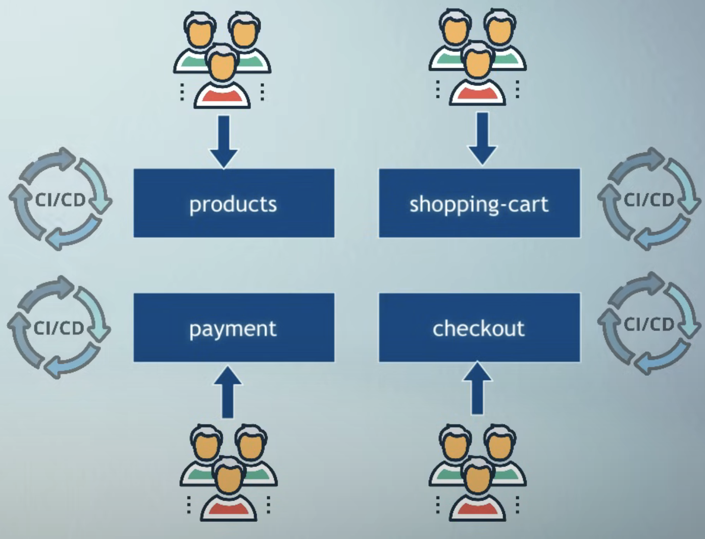
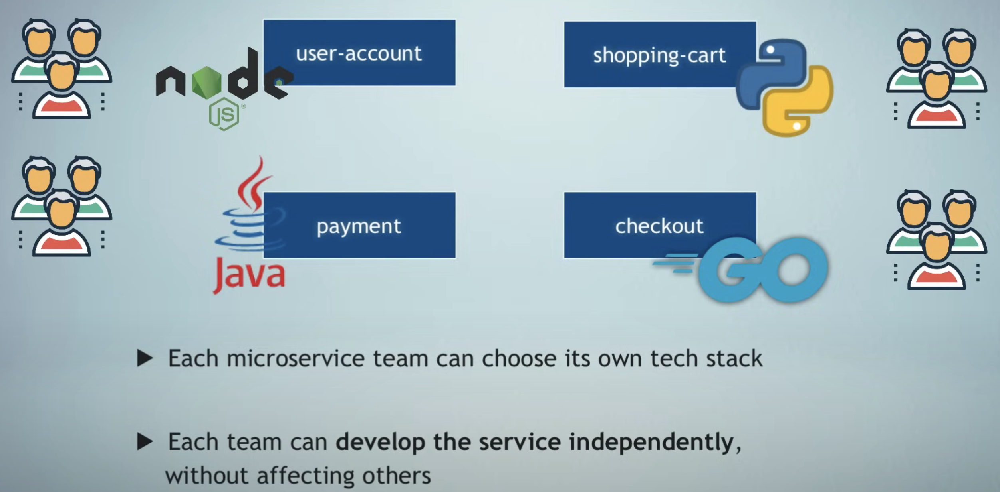

# Microservices

### Source: https://www.youtube.com/watch?v=rv4LlmLmVWk

---

#### Monolith and its downsides

Before microservices, the standard way of developing applications was with a monolithic architecture. This means the whole code and all components was part of a single unit. 

For example if we have an online shop application, all of its parts like user authentication, shopping cart, product catelog, notifications, payment, etc, all code for all these functionalities would be in one code base as part of one monolethic application. 

Everything is developed, deployed and scaled as 1 unit. 

this means the application must be written in a single language with one technology stach with a single run time. 

If we have different teams working on different parts of the application, they will need to coordinate to make sure that they don't effect eachother's work. 

Also if developers change code for the payment functionality, you'll need to build the whole application and deploy it as one package. You can't just deploy only the payment functionality changes separately. 

But when applications grow in size and complexity, this led to challenges. 

- Application is too large and complex 

- Parts are more tangles into eachother 

- You can only scale the entire app, instead of a specific serivce. this leads to higher insfrastructure consts and less flexibility 

- Difficulty if services need different dependency versions 

- Release process takes longer 

- On every change, the entire application needs to be tested 

- Entire application needs to be built and deployed 

- Bug in any module can potentially bring down the entire application 

#### The answer to all this issues is microservices architecture. 

With microservices, we break down the application in multiple smaller applications (smaller independent services). 

The question is how to decide how to break down the application. What codes where and how many such micro applications or microservices do we need to create and how big or small these services should be and how do they connect to eachother. 

The answer is: 

- Split based on buisiness functionalities and not technical functionalities. 

- So the microservice of online shop application will be: 
    * producs 
    * shopping-cart 
    * user account 
    * checkout 
    * etc 

- Each microservice must do one isolated thing (1 service for 1 specific job) 
    * For example a microservice should not be for both shopping cart and chackout 

- Microservices must be self-contained and independent 
    * This means each service must be developed, deployed and scaled separately without any tight dependencies on any other services eventhough they are part of same application. This is called lose coupling

    * 

    * With this, if we change only the payment service, we'll build and deploy only the payment service and nothing else will be affected. 

    * So this means each service has its own version 

    * 

#### Communication between microservices 

Communication using API Calls. 

Each service has its own API 

Each service has an endpoint on which it accepts requests from other services. 

Services can talk to eachother by sending requests to the respective API endpoint. 

This is synchronous communication where one service sends request to another service and waits for the response. 

Another way of communication is using a message broker with an asynchronous communication. 

Services send messages first to the intermediary message service or a broker such as RabbitMQ, the nthe message broker will forward that message to the respective service. 

The third way of communication between services which became so popular especially in the field of kubernetes, is using a service mesh. 

With service mesh, we have kind of a helper service which takes over the complete communication logic, so we don't have to code this logic into the microservices and have this communication logic kind of delegated to this extenal service. 

We can develope each service with a different programming languages (e.g node.JS, python, Java, GO)

